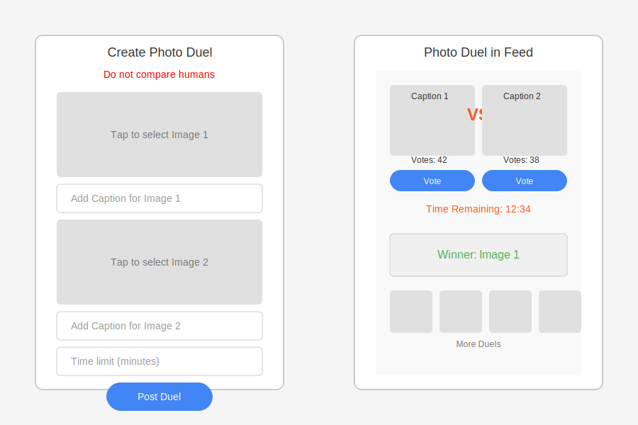

# LinkUp

## Table of Contents

- [Introduction](#introduction)
- [Features](#features)
- [Screenshots](#screenshots)
- [Installation](#installation)
- [Usage](#usage)
- [Firebase Integration](#firebase-integration)
- [Photo Duel Feature](#photo-duel-feature)
- [Contributing](#contributing)
- [License](#license)
- [Contact](#contact)

## Introduction

**LinkUp** is a modern and interactive mobile application built in Kotlin, integrated with Firebase for real-time data management and storage. The app allows users to share photos, interact with posts, manage their profiles, explore short video reels, and participate in engaging **Photo Duels**. With a responsive and intuitive user interface, LinkUp ensures smooth social engagement.

## Features

- 📸 **Post Creation**  
  Users can upload photos with captions, which are stored in Firebase Storage and displayed in a real-time feed.

- 🎥 **Reel Feature**  
  Users can upload short videos that are showcased in the reels section for interactive content browsing.

- 🔄 **Real-Time Feed**  
  Posts are updated instantly using Firestore, allowing seamless interaction with other users’ posts.

- ❤️ **Likes & Comments**  
  Users can like posts and leave comments, updated in real time.

- ⚔️ **Photo Duel**  
  Users can create photo duels where others vote on their preferred image. The winner is automatically declared after the voting period ends.

- 👤 **User Profiles**  
  Users can create and edit their profiles, including changing profile pictures and updating bios.

- ➕ **Follow System**  
  Users can follow/unfollow others to customize their feeds.

- 🖼️ **Full-Screen Post View**  
  Users can view posts in full-screen mode by tapping on the post image.

- 📤 **Share Post**  
  Users can share posts to other platforms or directly with friends.

- 🗑️ **Delete Post**  
  Users can delete their own posts from their feed or profile.

- 📱 **Responsive Design**  
  The UI is designed for a smooth and intuitive experience across various screen sizes.

## Screenshots

Here are some screenshots of the **LinkUp** app:

|  Home Feed  |    Search    |  Follow List  |    Photo Duel    |
|:-----------:|:------------:|:-------------:|:----------------:|
|  |  |  |  |


| |   |  |
|:------------:|:----------------:|:------------:|
|  |  |  |

## Installation

Step-by-step instructions to set up the **LinkUp** app:

1. **Clone the repository:**

    ```bash
    git clone https://github.com/Aadarsh45/LinkUp.git
    ```

2. **Open the project in Android Studio.**

3. **Build the project:**
    - Sync Gradle by clicking on "Sync Now" in the top right corner if prompted.

4. **Run the application:**
    - Connect your Android device or start an emulator.
    - Click on the "Run" button or use the shortcut `Shift + F10`.

## Usage

Instructions for using the app:

1. Open the **LinkUp** app on your device.
2. Create and share posts with photos or short videos.
3. Interact with posts by liking or commenting.
4. View posts in full-screen mode by tapping on the post image.
5. Share posts with others or delete your own posts.
6. Explore the reel feature for short video content.
7. Participate in **Photo Duels** by voting for your preferred images.
8. Create your own duels and let the community decide the winner.
9. Edit your profile, follow other users, and customize your feed.

## Firebase Integration

### **Firebase Authentication**

```kotlin
// Firebase Authentication for User Login
val auth = FirebaseAuth.getInstance()

fun loginUser(email: String, password: String) {
    auth.signInWithEmailAndPassword(email, password)
        .addOnCompleteListener { task ->
            if (task.isSuccessful) {
                Log.d("Login", "Login successful")
            } else {
                Log.d("Login", "Login failed: ${task.exception?.message}")
            }
        }
}
```

### **Firebase Firestore Setup**

```kotlin
// Firestore Database for Storing Posts
val db = FirebaseFirestore.getInstance()

fun addPost(post: Post) {
    db.collection("posts")
        .add(post)
        .addOnSuccessListener { documentReference ->
            Log.d("Firestore", "Post added with ID: ${documentReference.id}")
        }
        .addOnFailureListener { e ->
            Log.w("Firestore", "Error adding post", e)
        }
}
```

### **Firebase Storage for Image Upload**

```kotlin
// Uploading Image to Firebase Storage
val storageRef = FirebaseStorage.getInstance().reference.child("posts/${UUID.randomUUID()}.jpg")

fun uploadImage(fileUri: Uri) {
    storageRef.putFile(fileUri)
        .addOnSuccessListener {
            Log.d("Storage", "Image upload successful")
        }
        .addOnFailureListener { e ->
            Log.w("Storage", "Image upload failed", e)
        }
}
```

## Photo Duel Feature

### **Overview**
The **Photo Duel** feature is a gamified comparison tool that allows users to post two images side-by-side and let others vote on which one they prefer. The feature includes real-time vote updates and automatic winner declaration after the voting period.

### **Core Functionality**
- Create duels by selecting two images, adding captions, and setting a time limit.
- Allow other users to vote for either image.
- Automatically declare a winner when the time limit expires.
- Duels are displayed in a horizontally scrolling list at the top of the home feed.

### **Data Flow**
1. **Creating a Duel**  
    - User selects two images from the gallery.
    - Adds captions and sets a time limit.
    - Images are uploaded to Firebase Storage.
    - Duel data (image URLs, captions, time limit) is saved in Firestore.

2. **Displaying Duels**  
    - HomeFragment fetches duels from Firestore.
    - Duels are displayed using a horizontally scrolling RecyclerView.
    - Ended duels display the winner and disable voting.

3. **Voting Process**  
    - Users vote by clicking on either image.
    - Vote count is incremented via a Firestore transaction.
    - UI updates to reflect new vote count.

4. **Winner Declaration**  
    - System checks if the duel has ended.
    - Compares vote counts and declares a winner.
    - UI displays the winner and voting is disabled.

### **Security & Moderation**
- A **"Do not compare humans"** warning is displayed to discourage harmful comparisons.
- Firebase rules ensure only valid duels are processed.

## Contributing

Contributions are welcome! Please follow these steps to contribute:

1. **Fork the repository.**

2. **Create a new branch:**

    ```bash
    git checkout -b feature-name
    ```

3. **Make your changes.**

4. **Commit your changes:**

    ```bash
    git commit -m 'Add some feature'
    ```

5. **Push to the branch:**

    ```bash
    git push origin feature-name
    ```

6. **Open a pull request.**

## License

This project is licensed under the MIT License - see the [LICENSE](LICENSE) file for details.

## Contact

For any questions or suggestions, feel free to reach out at [aadarshchaurasia45@gmail.com](mailto:aadarshchaurasia45@gmail.com).


